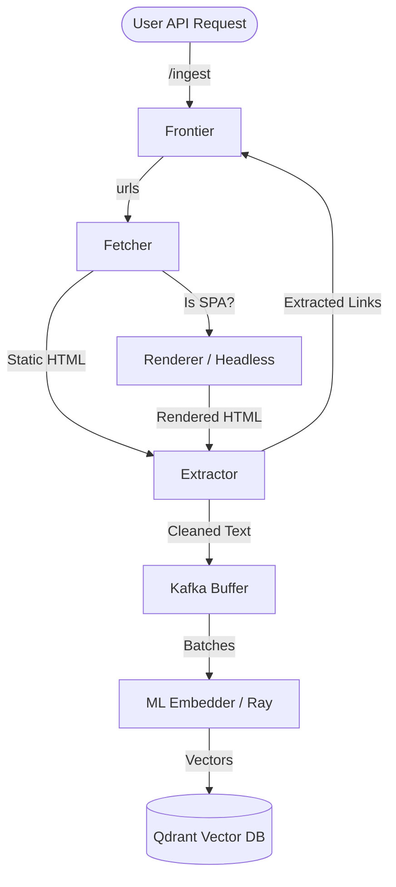

# Photon Pipeline Architecture

This document describes the complete distributed pipeline for the Photon web crawler and embeddings generator.

## Overview

Photon is designed as an event-driven, highly scalable, multi-stage pipeline. The system efficiently crawls web pages, extracts raw text, generates vector embeddings, and stores them for search or machine learning use cases. The components are independently deployable and communicate via Apache Kafka.

## Architecture Tiers

The pipeline is structured into multiple decoupled tiers:

### 1. Ingestion & Frontier (Zig)
The `frontier` is the central coordinator for URL management, built for extreme throughput and low latency.
- **Ingestion:** Receives new URLs through a REST API (`/ingest`).
- **Deduplication:** Utilizes Redis to track visited URLs to avoid redundant crawling.
- **Rate Limiting (Politeness):** Ensures target servers are not overwhelmed by rate-limiting requests per domain.
- **Dispatching:** Pushes clean, ready-to-crawl URLs to the Kafka `urls` topic.

### 2. Fetching & Routing (Go)
The `fetcher` is a highly concurrent service responsible for downloading the HTML content of the queued URLs.
- **Consumption:** Listens to the `urls` Kafka topic.
- **Fast HTML Download:** Connects to servers and streams the HTML payload.
- **Dynamic Heuristic Engine:** Analyzes raw HTML snippets (e.g., `
`, `__NEXT_DATA__`) to determine if the page requires JavaScript execution.
- **Routing:**
  - *Static pages:* The HTML is passed forward.
  - *Dynamic pages:* The URL is sent to the `dynamic-urls` Kafka topic.

### 3. Rendering Modern Web Apps (Go)
The `renderer` specifically targets Single Page Applications (SPAs) and heavy JavaScript pages.
- **Consumption:** Listens to the `dynamic-urls` topic.
- **Headless Execution:** Utilizes `chromedp` to run headless Chromium instances.
- **Hydration:** Waits for network idleness and DOM stability before extracting the rendered `outerHTML`.
- **Forwarding:** Pushes the fully hydrated HTML back into the pipeline.

### 4. Parsing & Link Extraction (Zig)
The `extractor` (Tier 1 Parser) processes the raw HTML coming from the Fetcher and Renderer.
- **Input:** Consumes from the `fetched-pages` topic.
- **Link Extraction:** Parses `href` attributes and pushes new discovered URLs back to the `frontier`'s `urls` topic.
- **Text Cleaning:** Strips HTML tags, styles, and scripts to extract clean text.
- **Forwarding:** Publishes cleaned documents and metadata to the `cleaned_documents` topic.

### 5. Accumulation Buffer (Kafka)
The `cleaned_documents` topic acts as a durable buffer (Tier 2). It absorbs spikes in crawling and parsing, matching the high throughput of the crawler to the slower pace of the ML embedding process.

### 6. Embedding Generation (Ray / Python)
The final stage (Tier 3 ML Batch Processor) handles machine learning inference.
- **Batching:** Reads batches of documents from `cleaned_documents`.
- **Vectorization:** Runs dense embedding models (e.g., Sentence Transformers, ONNX Runtime) to convert text into vector embeddings.
- **Storage:** Upserts the generated vectors and associated metadata directly into a Vector Database (like **Qdrant**).

## Data Flow Diagram

## Infrastructure Components
- **Apache Kafka:** The primary message bus passing data between all stages (`urls`, `dynamic-urls`, `fetched-pages`, `cleaned_documents`).
- **Redis:** State store for the Frontier to manage URL deduplication and politeness delays.
- **Qdrant:** Destination vector database.
