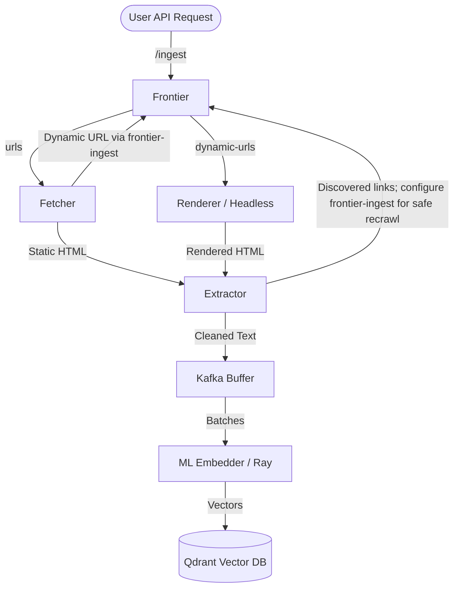

# Photon pipeline overview

> **Canonical design:** [Architecture](architecture.md) is the authoritative
> description of crawler safety, Kafka contracts, consistency guarantees, and
> known limitations. This page is a stage-by-stage overview.

This document describes the complete distributed pipeline for the Photon web crawler and embeddings generator.

## Overview

Photon is designed as an event-driven, highly scalable, multi-stage pipeline. The system efficiently crawls web pages, extracts raw text, generates vector embeddings, and stores them for search or machine learning use cases. The components are independently deployable and communicate via Apache Kafka.

## Architecture Tiers

The pipeline is structured into multiple decoupled tiers:

### 1. Ingestion & Frontier (Zig)
The `frontier` is the central coordinator for URL management, built for extreme throughput and low latency.
- **Ingestion:** Receives new URLs through a REST API (`/ingest`).
- **Deduplication:** Utilizes Redis to track visited URLs to avoid redundant crawling.
- **Rate Limiting (Politeness):** Uses Redis-backed, atomic per-host request-slot reservations and cached robots policy. See [Architecture](architecture.md#politeness).
- **Dispatching:** Pushes clean, ready-to-crawl URLs to the Kafka `urls` topic.
- **Metrics:** Exposes a `/metrics` endpoint (on the same REST port) with Prometheus-formatted counters: `urls_ingested_total`, `urls_filtered_total`, `urls_deduped_total`.

### 2. Fetching & Routing (Go)
The `fetcher` is a highly concurrent service responsible for downloading the HTML content of the queued URLs.
- **Consumption:** Listens to the `urls` Kafka topic.
- **Fast HTML Download:** Connects to servers and streams the HTML payload.
- **Dynamic Heuristic Engine:** Analyzes raw HTML snippets (e.g., `
`, `__NEXT_DATA__`) to determine if the page requires JavaScript execution.
- **Routing:**
  - *Static pages:* The HTML is saved to MinIO, and a payload containing `s3_key` is published to the `fetched-pages` topic.
  - *Dynamic pages:* The URL returns to `frontier-ingest` as `render:<url>` so the Renderer receives a second polite host slot through `dynamic-urls`.
- **Metrics:** Exposes `/metrics` via `promhttp` (configurable port via `PROMETHEUS_PORT`, default `2112`) with `fetcher_urls_processed_total` counter by status.

### 3. Rendering Modern Web Apps (Go)
The `renderer` specifically targets Single Page Applications (SPAs) and heavy JavaScript pages.
- **Environment:** Runs on a Debian-based container (e.g. `debian:bookworm-slim`) to natively support `glibc` required by headless Chrome. CPU caps should be avoided to prevent startup latency constraints.
- **Consumption:** Listens to the `dynamic-urls` topic.
- **Headless Execution:** Utilizes `chromedp` to run headless Chromium instances with stability flags (`--no-sandbox`, `--disable-dev-shm-usage`, etc.).
- **Hydration:** Waits for network idleness and DOM stability before extracting the rendered `outerHTML`.
- **Forwarding:** Stores hydrated HTML in MinIO, then publishes the same `{url,s3_key}` envelope used for static pages.
- **Metrics:** Exposes `/metrics` via `promhttp` with `renderer_pages_rendered_total` counter (labels: `success`, `fetch_error`, `storage_error`, `produce_error`).

### 4. Parsing & Link Extraction (Zig)
The `extractor` (Tier 1 Parser) processes the raw HTML coming from the Fetcher and Renderer.
- **Input:** Consumes JSON payloads from the `fetched-pages` topic and retrieves the corresponding raw HTML from MinIO using the provided `s3_key`.
- **Link Extraction:** Parses `href` attributes and publishes discovered links to its configured URL topic. The default `urls` topic bypasses Frontier admission; see the [feedback-loop limitation](architecture.md#current-feedback-loop-limitation) before enabling recrawl.
- **Text Cleaning:** Strips HTML tags, styles, and scripts to extract clean text.
- **Forwarding:** Publishes cleaned documents and metadata to the `cleaned_documents` topic.
- **Metrics:** Runs a dedicated HTTP server (configurable port via `PROMETHEUS_PORT`, default `8001`) exposing `html_processed_total`, `urls_extracted_total`, and `documents_produced_total`.

### 5. Accumulation Buffer (Kafka)
The `cleaned_documents` topic acts as a durable buffer (Tier 2). It absorbs spikes in crawling and parsing, matching the high throughput of the crawler to the slower pace of the ML embedding process.

### 6. Embedding Generation (Ray / Python)
The final stage (Tier 3 ML Batch Processor) handles machine learning inference.
- **Batching:** Reads batches of documents from `cleaned_documents`.
- **Vectorization:** Runs dense embedding models (e.g., Sentence Transformers, ONNX Runtime) to convert text into vector embeddings.
- **Storage:** Upserts the generated vectors and associated metadata directly into a Vector Database (like **Qdrant**).
- **Execution Modes:** Architected to run on Ray for dynamic scale-out across multiple GPUs or machines depending on the inference load (`NUM_WORKERS > 1`). For environments that heavily rely on central Prometheus scraping, running in single-threaded mode (`NUM_WORKERS=1`) ensures accurate metrics collection by running the worker loop synchronously in the main thread rather than delegating it to Ray child processes.
- **Metrics:** Exposes `/metrics` via `prometheus_client` (configurable port via `PROMETHEUS_PORT`, default `8000`) with `embedder_messages_processed_total` counter by status.

## Data Flow Diagram

## Observability

All components are instrumented with Prometheus metrics and scraped by a central Prometheus server. A pre-provisioned Grafana instance provides out-of-the-box dashboards.

### Prometheus Scrape Targets

| Job | Target | Port | Type |
|-----|--------|------|------|
| `frontier` | Frontier REST API | 8080 | Custom `/metrics` (Zig) |
| `fetcher` | Fetcher service | 2112 | `promhttp` (Go) |
| `renderer` | Renderer service | 3000 | `promhttp` (Go) |
| `extractor` | Extractor service | 8001 | Custom `/metrics` (Zig) |
| `embedder` | Embedder service | 8000 | `prometheus_client` (Python) |
| `kafka` | Kafka Exporter sidecar | 9308 | `danielqsj/kafka-exporter` |
| `redis` | Redis Exporter sidecar | 9121 | `oliver006/redis_exporter` |
| `minio` | MinIO native | 9000 | `/minio/v2/metrics/cluster` |
| `qdrant` | Qdrant native | 6333 | `/metrics` |

### Grafana Dashboard

The **Photon Pipeline** dashboard is auto-provisioned and includes:
- **Pipeline Overview:** Stat panels for URLs ingested, filtered, deduped, pages rendered, HTML processed, and embeddings generated.
- **Throughput Charts:** Time-series for ingestion rate, fetching/rendering rate, extraction rate, and embedding rate.
- **Kafka:** Consumer group lag and per-topic message rates.
- **Redis:** Memory usage and connected clients.
- **MinIO:** Object size distribution.
- **Qdrant:** Collection and vector counts.

### Accessing Monitoring

| Service | URL |
|---------|-----|
| Grafana | [http://localhost:3001](http://localhost:3001) (admin/admin) |
| Prometheus | [http://localhost:9090](http://localhost:9090) |

## Infrastructure Components
- **Apache Kafka:** The primary message bus passing data between all stages (`urls`, `dynamic-urls`, `fetched-pages`, `cleaned_documents`), with Dead Letter Queues (DLQ) for error handling.
- **MinIO:** Object storage for temporarily holding large HTML payloads, reducing Kafka message sizes. Metrics enabled via `MINIO_PROMETHEUS_AUTH_TYPE=public`.
- **Redis:** State store for the Frontier to manage URL deduplication and politeness delays.
- **Qdrant:** Destination vector database with native Prometheus metrics.
- **Kafka Exporter:** Sidecar container (`danielqsj/kafka-exporter`) exposing Kafka broker and consumer group metrics.
- **Redis Exporter:** Sidecar container (`oliver006/redis_exporter`) exposing Redis server metrics.

## Configuration

All service configurations are managed through environment variables. See `.env.example` for the full list. Key variables:

| Variable | Default | Description |
|----------|---------|-------------|
| `PROMETHEUS_PORT` | `9090` | Prometheus server host port |
| `FETCHER_PROMETHEUS_PORT` | `2112` | Fetcher metrics port |
| `EMBEDDER_PROMETHEUS_PORT` | `8000` | Embedder metrics port |
| `EXTRACTOR_PROMETHEUS_PORT` | `8001` | Extractor metrics port |
| `MINIO_ROOT_USER` | `minioadmin` | MinIO access key |
| `MINIO_ROOT_PASSWORD` | `minioadmin` | MinIO secret key |

Configuration files are stored under `config/`:
- `config/prometheus.yml` — Prometheus scrape configuration
- `config/grafana/provisioning/` — Grafana datasource and dashboard auto-provisioning
- `config/grafana/dashboards/` — Dashboard JSON definitions
